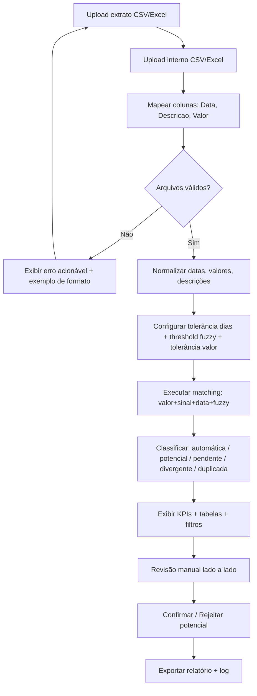

# PRD.md — Conciliação Bancária Automatizada
## `automated_bank_reconciliation`

| Campo | Valor |
|---|---|
| Versão | 1.1 |
| Data | 01/10/2026 |
| Status | Aprovado (MVP) + adendo S5/S6 sem mudança de regra |
| Idioma | pt-BR |
| Origem | `Conciliação_Bancária_Automatizada.md` + `DESIGN.md` |
| Formato de saída | Markdown pronto para `PRD.md` |

---

## 1. Visão Geral / Objetivo

### 1.1 Resumo Executivo

Desenvolver uma ferramenta local em Python que compara lançamentos internos da empresa com o extrato bancário e classifica cada transação em **conciliada, potencial correspondência (revisão), pendente ou divergente**.

O principal valor é o **relatório de exceções**: quantos lançamentos foram conciliados automaticamente, quantos estão pendentes e quais exigem análise manual. O sistema não classifica como conciliado apenas por coincidência de valor; aplica regra composta de **valor + data + sinal (débito/crédito) + descrição aproximada + detecção de duplicidade**.

### 1.2 Objetivo do Produto

- Automatizar a comparação entre duas bases tabulares: `extrato_bancario` x `lancamentos_internos`.
- Reduzir esforço manual e erro humano na conciliação.
- Separar de forma auditável o que foi conciliado automaticamente do que exige revisão humana.
- Registrar quais regras geraram cada decisão e quais exceções ocorreram.
- Fornecer tela de revisão e relatório exportável para fechamento financeiro.

### 1.3 Objetivos de Negócio (OB)

| ID | Objetivo de Negócio | Indicador associado |
|---|---|---|
| OB-01 | Reduzir tempo de conciliação mensal | Tempo médio por lote < 5 min para 5.000 linhas |
| OB-02 | Aumentar confiabilidade do fechamento | 0 falsos positivos por valor isolado |
| OB-03 | Dar rastreabilidade à conciliação | 100% das decisões com regra registrada |
| OB-04 | Priorizar análise humana onde há risco | < 30% do volume cai em revisão manual em cenário normal |
| OB-05 | Viabilizar operação sem infraestrutura complexa | Execução 100% local, sem backend/servidor |

---

## 2. Contexto e Problema

### 2.1 Problema

A conciliação manual entre sistema interno (ERP/planilha) e extrato bancário é lenta, propensa a erro e não escala. Diferenças comuns que quebram a comparação ingênua:

- Descrições diferentes para o mesmo fato (`Pagamento Fornecedor X` vs `Fornecedor X NF 1254`).
- Diferença de data entre compensação bancária e lançamento interno (ex.: `11/09/2026` vs `12/09/2026`).
- Sinais inconsistentes (`-R$ 2.500` vs `2.500 D` vs `(2500)`).
- Formatos de data/valor inconsistentes entre CSV/Excel.
- Pagamentos duplicados, transações distintas com mesmo valor, divergências de centavos.

### 2.2 Processos Atuais Substituídos

1. Exportação manual do extrato (internet banking) + exportação do sistema interno.
2. Comparação visual linha a linha em Excel.
3. Marcação manual de conciliados/pendentes.
4. Relatório manual de pendências para o financeiro.

### 2.3 Resultado Esperado

- Upload de 2 arquivos → normalização → matching configurável → classificação → revisão em tela → relatório de exceções exportável.
- Exemplo de referência (obrigatório):
  - Extrato: `10/09/2026 | Pagamento Fornecedor X | -R$ 2.500` e `11/09/2026 | Recebimento Cliente Y | R$ 4.800`
  - Interno: `10/09/2026 | Fornecedor X NF 1254 | -R$ 2.500` e `12/09/2026 | Cliente Y | R$ 4.800`
  - Comportamento esperado: ambos os pares são correlacionáveis por **valor + sinal + data dentro da tolerância**, mesmo com descrições diferentes. O segundo caso só concilia se tolerância de data ≥ 1 dia.

---

## 3. Escopo

### 3.1 Dentro do Escopo (In)

- Importação de extrato bancário em `.csv`, `.xls`, `.xlsx`.
- Importação de lançamentos internos em `.csv`, `.xls`, `.xlsx`.
- Normalização de datas, valores e descrições.
- Motor de comparação com critérios configuráveis.
- Classificação: `conciliada_automatica`, `potencial_revisao`, `pendente_sem_correspondencia`, `divergente`, `duplicada_suspeita`.
- Tela de revisão das divergências em Streamlit.
- Relatório de conciliação e relatório de exceções (tela + exportação CSV/Excel).
- Log de regras aplicadas e exceções.
- Design obrigatoriamente conforme `DESIGN.md` (estilo Apple minimalista).

### 3.2 Fora do Escopo (Out)

- Integração direta com APIs bancárias / Open Finance.
- Conexão direta com ERP / banco de dados corporativo.
- Conciliação multi-moeda e conversão cambial.
- Leitura de PDF de extrato / OCR.
- Multiusuário com login, permissões avançadas e trilha por usuário.
- Agendamento automático / robô contínuo / envio de e-mail.
- Aplicativo mobile nativo.
- NF-e, boletos, DDA, CNAB 240/400 (futuro, ver Roadmap).

---

## 4. Personas / Usuários

### 4.1 P-01 — Analista Financeiro (usuário primário)

- Importa os dois arquivos mensalmente/semanalmente.
- Ajusta tolerância de data e threshold de descrição.
- Revisa potenciais e pendentes, confirma ou rejeita.
- Exporta relatório para fechamento.

### 4.2 P-02 — Contador / Auditor (usuário secundário)

- Não opera; consome relatório e log de regras.
- Precisa entender por que cada item foi conciliado ou não.

### 4.3 P-03 — Operador Administrativo

- Prepara arquivos, padroniza colunas, roda conciliação inicial.

> Permissões MVP: uso local single-user, sem autenticação.

---

## 5. User Stories (US)

| ID | Como | Quero | Para | Prioridade MoSCoW |
|---|---|---|---|---|
| US-01 | Analista | importar extrato e interno em CSV/Excel | iniciar conciliação sem conversão manual | Must |
| US-02 | Analista | configurar tolerância de dias, threshold fuzzy e tolerância de valor | adaptar regra à realidade do banco/empresa | Must |
| US-03 | Analista | ver conciliados automáticos separados de revisão | confiar apenas no que tem evidência composta | Must |
| US-04 | Analista | ver lista de sem correspondência dos dois lados | tratar pendências | Must |
| US-05 | Analista | revisar potenciais lado a lado e confirmar/rejeitar | resolver ambiguidade com julgamento humano | Must |
| US-06 | Contador | exportar relatório de exceções com regra aplicada | auditar fechamento | Must |
| US-07 | Analista | detectar duplicidades | evitar baixa dupla | Must |
| US-08 | Analista | ver KPIs (% conciliado, pendente, divergente) | medir avanço | Should |
| US-09 | Operador | entender erro de arquivo inválido em linguagem clara | corrigir e reimportar | Should |

---

## 6. Fluxo de Uso / Jornada

1. Usuário abre app Streamlit.
2. Etapa 1 — Upload: envia `extrato.csv/xlsx` e `interno.csv/xlsx`. Sistema mostra preview das 5 primeiras linhas de cada.
3. Etapa 2 — Mapeamento: confirma qual coluna é `Data`, `Descrição`, `Valor`. Default tenta auto-detecção por nome (`data`, `date`, `descricao`, `descrição`, `historico`, `valor`, `amount`).
4. Etapa 3 — Parâmetros: ajusta `tolerancia_dias` (default 2), `threshold_fuzzy` (default 85), `tolerancia_valor` (default 0.00, configurável ex.: 0.05).
5. Etapa 4 — Execução: clica em `Conciliar`. Sistema executa normalização + matching + classificação.
6. Etapa 5 — Resultado: vê KPIs no topo + 6 abas/tabelas: Conciliadas, Para Revisão, Pendentes, Divergentes, Duplicadas, Erros.
7. Etapa 6 — Revisão: em `Para Revisão`, seleciona par sugerido, vê score e regra, confirma ou rejeita. Rejeição devolve para pendente.
8. Etapa 7 — Exportação: exporta `relatorio_conciliacao.xlsx` + `relatorio_excecoes.csv` com log de regra.



---

## 7. Requisitos Funcionais

### 7.1 Importação e mapeamento

| ID | Requisito | Prioridade | Critérios de Aceite |
|---|---|---|---|
| RF-001 | Importar extrato bancário em `.csv`, `.xls`, `.xlsx` | Must | Aceita 3 formatos até 20 MB; preview 5 linhas; rejeita `.pdf/.txt` com mensagem clara |
| RF-002 | Importar lançamentos internos em `.csv`, `.xls`, `.xlsx` | Must | Mesmo aceite de RF-001, independente para segundo arquivo |
| RF-003 | Mapeamento de colunas `Data`, `Descrição`, `Valor` com auto-detecção | Must | Auto-detecta por nome normalizado; permite correção manual; bloqueia execução se obrigatória não mapeada |
| RF-004 | Validação de arquivo e reporte de erros linha a linha | Must | Lista linhas com erro + motivo; linhas com erro não participam do matching; arquivo vazio gera erro bloqueante |

### 7.2 Normalização

| ID | Requisito | Prioridade | Critérios de Aceite |
|---|---|---|---|
| RF-005 | Normalizar datas para `YYYY-MM-DD` | Must | Aceita `DD/MM/YYYY`, `YYYY-MM-DD`, `DD-MM-YYYY`, datetime Excel; inválidas vão para tabela de erros |
| RF-006 | Normalizar valores para decimal com sinal | Must | Trata `R$ 2.500,00`, `2500.00`, `(2500)`, `-2500`, `2.500 D/C`; preserva original + normalizado |
| RF-007 | Normalizar descrições (caixa, acento, espaços, pontuação) | Must | Mantém original para exibição + forma canônica comparável |

### 7.3 Parametrização

| ID | Requisito | Prioridade | Critérios de Aceite |
|---|---|---|---|
| RF-008 | Configurar tolerância de data em dias (default 2, intervalo 0–30) | Must | Default 2; exemplo `11/09` x `12/09` concilia com default; com 0 só mesma data |
| RF-009 | Configurar threshold fuzzy rapidfuzz (default 85, 0–100) | Must | Default 85; permite desativar fuzzy; score exibido na revisão |
| RF-010 | Configurar tolerância de valor (default 0.00, ex.: 0.05) | Should | Default exige igualdade exata; 0.05 permite divergência de centavos |

### 7.4 Motor de conciliação

| ID | Requisito | Prioridade | Critérios de Aceite |
|---|---|---|---|
| RF-011 | Correspondência exata por valor + sinal + data | Must | `-2500` em `10/09` x `-2500` em `10/09` = candidata automática (se passar RN) |
| RF-012 | Correspondência com tolerância de data | Must | `4800` em `11/09` x `4800` em `12/09` concilia com tolerância ≥1; fora não concilia |
| RF-013 | Tratamento de sinal débito/crédito | Must | `-2500` nunca concilia com `+2500`; `D/C`, `+/-`, parênteses respeitados |
| RF-014 | Detecção de duplicidades intra-base | Must | 2 linhas idênticas na mesma base geram `duplicada_suspeita`; nunca concilia auto |
| RF-015 | Fuzzy matching de descrição com rapidfuzz | Must | Usa `token_set_ratio` ou `WRatio`; score < threshold não eleva para automática |
| RF-016 | Classificação final em 5 estados + separação auto vs manual | Must | `conciliada_automatica`, `potencial_revisao`, `pendente_sem_correspondencia`, `divergente`, `duplicada_suspeita`; automática exige regra forte (RN-06) |

### 7.5 Revisão, relatório e auditoria

| ID | Requisito | Prioridade | Critérios de Aceite |
|---|---|---|---|
| RF-017 | Listar lançamentos sem correspondência dos dois lados | Must | Duas tabelas: `extrato sem par` e `interno sem par`; filtros por período, valor, texto; filtro por período nunca oculta linha sem data legível; filtro por valor entende `R$ 2.500,00` |
| RF-018 | Tela de revisão lado a lado com confirmação manual | Must | Exibe par + diff dias + diff valor + score + regra; ações `Confirmar` / `Rejeitar`; confirmação move para conciliada_manual com log |
| RF-019 | Gerar relatório de conciliação exportável CSV + Excel | Must | Exporta classificações + normalizadas + regra + score; Excel com abas por status |
| RF-020 | Gerar relatório de exceções | Must | Contém apenas `potencial`, `pendente`, `divergente`, `duplicada`, `erro`; mostra contagem e % por categoria |
| RF-021 | Registrar log de regras e exceções por decisão | Must | Cada linha registra `regra_id`, parâmetros, scores; log exportável e visível |
| RF-022 | Exibir KPIs de exceções no topo | Should | Total, % conciliado auto, % revisão, % pendente, % divergente |

---

## 8. Requisitos Não-Funcionais

| ID | Categoria | Requisito | Critério verificável |
|---|---|---|---|
| NFR-001 | Performance | Conciliar 5.000 x 5.000 linhas em < 30s local | Medido com bloqueio por valor antes de fuzzy |
| NFR-002 | Performance | Preview e validação < 3s para 20 MB | Teste com CSV 20 MB |
| NFR-003 | Escalabilidade | Suportar até 50.000 linhas por base (degradado com aviso) | Teste de carga + mensagem se > 20k |
| NFR-004 | Disponibilidade | Execução 100% local/offline após instalação | Sem chamada de rede obrigatória |
| NFR-005 | Segurança | Não enviar dados financeiros para serviço externo | Sem telemetria; fuzzy local |
| NFR-006 | Segurança | Sanitizar nomes e limitar tamanho (20 MB) | Rejeita path traversal e estouro |
| NFR-007 | Confiabilidade | Não classificar como automática apenas por valor | Teste com 2 transações distintas mesmo valor → não concilia auto |
| NFR-008 | Usabilidade | Fluxo em ≤ 7 cliques do upload ao relatório; mensagens pt-BR | Teste com P-01 |
| NFR-009 | Design | Seguir obrigatoriamente `DESIGN.md` | Checklist visual seção 11 |
| NFR-010 | Acessibilidade | Alvo ≥ 44x44, contraste, labels, navegação teclado | Verificação manual |
| NFR-011 | Portabilidade | Rodar Windows, macOS, Linux Python 3.10+ | `pip install -r requirements.txt` + `streamlit run app.py` |
| NFR-012 | Compatibilidade | Ler `.csv` (utf-8, latin1, `,`/`;`) e `.xls`/`.xlsx` via `openpyxl` | Matriz de arquivos de teste |
| NFR-013 | Manutenibilidade / Código | Código 100% em inglês (variáveis, constantes, funções, classes, módulos); aspas simples; sem comentários | `ruff` + revisão reprova português em identificador e aspas duplas desnecessárias |
| NFR-013a | Localização pt-BR | Dados e UI 100% em pt-BR: colunas `Data`, `Descrição`, `Valor`; dashboard Streamlit; relatórios exportados; mensagens de erro; arquivos de exemplo | Revisão manual: nenhum label técnico em inglês visível ao usuário |
| NFR-014 | Manutenibilidade | Cobertura testes motor ≥ 80% | `pytest --cov` |
| NFR-015 | Resiliência | Falha em 1 linha não aborta lote | Teste com linha corrompida |
| NFR-016 | Recuperação | Reexecução idempotente: mesmos arquivos + parâmetros = mesmo resultado | Teste de repetição |

### 8.1 Padrão de código clean (normativo)

- **Código 100% em inglês (padrão de mercado):** variáveis, constantes, funções, classes e módulos em inglês. Ex.: `normalize_value`, `compare_pair`, `date_tolerance_days`, `fuzzy_threshold`, `value_tolerance`, `BANK_STATEMENT`, `INTERNAL_LEDGER`. Proibido identificador em português (`normalizar_valor`, `tolerancia_dias`, `valor`).
- **Dados e UI 100% em pt-BR (consumidor brasileiro):** colunas de entrada/saída `Data`, `Descrição`, `Valor`; labels do dashboard; headers dos relatórios `relatorio_conciliacao.xlsx` / `relatorio_excecoes.csv`; mensagens de erro; arquivos de exemplo `extrato.csv`, `interno.xlsx`. Nenhum termo técnico em inglês visível ao usuário.
- Camada de mapeamento obrigatória: `loader` lê colunas pt-BR → converte para variáveis internas em inglês → `report` / `ui` reconvertem para pt-BR na exibição/exportação.
- Usar **aspas simples** em todo Python (`'text'`, não `"text"`), exceto quando string contém aspas simples ou docstrings.
- **Sem comentários**; código limpo e autoexplicativo.
- Funções responsabilidade única, máx. ~30 linhas; nomes explícitos (`normalize_value`, `compare_pair`).
- Sem código morto, sem `print` debug; usar `logging`.
- Formatação via `ruff` ou `black` adaptado para single-quote.

```python
def normalize_value(raw):
    if raw is None or raw == '':
        return None
    txt = str(raw).strip().replace('R$', '').strip()
    if txt.startswith('(') and txt.endswith(')'):
        txt = '-' + txt[1:-1]
    txt = txt.replace('.', '').replace(',', '.') if ',' in txt else txt
    return Decimal(txt)
```

---

## 9. Regras de Negócio de Conciliação (RN)

> Fronteira de idioma (normativo): código interno obrigatoriamente em inglês (`date_tolerance_days`, `value_tolerance`, `fuzzy_threshold`, `day_diff`, `value_diff`, `description_score`, `rule_id`, `match_id`, `reason`). Dados, dashboard, relatórios e colunas obrigatoriamente em pt-BR (`Data`, `Descrição`, `Valor`, `Tolerância de dias`, `Relatório de exceções`). Documentação do PRD usa rótulos pt-BR; código usa equivalentes em inglês.

| ID | Regra | Especificação |
|---|---|---|
| RN-01 | Valor + data como base, nunca valor isolado | Exige `valor igual (± tolerancia_valor)` **E** `sinal igual` **E** `abs(data_extrato - data_interno) <= tolerancia_dias`. Valor sozinho gera no máx. `potencial_revisao`. |
| RN-02 | Tolerância de datas configurável, default 2 dias | `default 2, min 0, max 30`. `11/09` x `12/09` diff=1 → dentro do default. `10/09` x `15/09` diff=5 → fora do default. |
| RN-03 | Tratamento de sinais débito/crédito | Normalizar para `+1` e `-1`. `-`, `D`, `() `= débito; `+`, `C` = crédito. Sinais diferentes bloqueiam matching. |
| RN-04 | Detecção de duplicidades | Se mesma base tem ≥2 linhas mesmo `valor+sinal` e `diff data ≤ tolerancia` e `fuzzy ≥ 95`, marcar `duplicada_suspeita`. Não concilia auto. |
| RN-05 | Fuzzy matching com rapidfuzz | `token_set_ratio` sobre descrição normalizada. `default 85`. Score 0–100 exibido. Se desativado, descrição ignorada. |
| RN-06 | Separação automática vs revisão | `conciliada_automatica` sse: valor+sinal OK **E** data dentro tolerância **E** (fuzzy ≥ threshold **OU** fuzzy off com 1:1 sem ambiguidade) **E** sem duplicidade **E** sem ambiguidade (1 candidato). Senão: `potencial_revisao` se ≥1 candidato próximo; `pendente` se nenhum; `divergente` se diff valor ≤ limite mas não zero. |
| RN-07 | Desempate 1:N / N:1 | Se 1 casa com N, escolhe menor `diff data`, depois maior `fuzzy`. Demais viram `potencial_revisao` com `ambiguidade_multipla`. Nunca auto em ambiguidade. |
| RN-08 | Tolerância de valor | `default 0.00`. Se `>0`, permite `abs(v1-v2) <= tolerancia`. Ex.: `2500.00` x `2500.04` com `0.05` = valor OK mas `potencial_revisao` com `divergencia_centavos`. |
| RN-09 | Registro de regras e exceções | Cada saída contém `status`, `par_id`, `diff_dias`, `diff_valor`, `score_descricao`, `regra_id`, `parametros_snapshot`, `motivo`. Erros contêm `erro_codigo` (`DATA_INVALIDA`, `VALOR_INVALIDO`, `COLUNA_AUSENTE`). |
| RN-10 | Confirmação manual tem precedência | `conciliada_manual` sobrescreve auto e registra ação + timestamp. Rejeição move para `pendente`. Reversível na sessão. |

### 9.1 Exemplos normativos

- **Caso A (exato):** extrato `10/09/2026 -2500 Pagamento Fornecedor X` x interno `10/09/2026 -2500 Fornecedor X NF 1254`. `diff_dias=0`, `diff_valor=0` → `potencial_revisao` se fuzzy < 85, senão `conciliada_automatica`.
- **Caso B (tolerância):** extrato `11/09/2026 +4800 Recebimento Cliente Y` x interno `12/09/2026 +4800 Cliente Y`. `diff_dias=1 ≤2` → `conciliada_automatica`.
- **Caso C (armadilha valor):** dois pagamentos distintos `-1500` em datas diferentes → nunca automática; `potencial_revisao` + alerta ambiguidade.
- **Caso D (sinal):** `-2500` x `+2500` mesmo dia → bloqueado por RN-03 → `pendente`.

---

## 10. Modelo de Dados / Formato CSV-Excel

### 10.1 Colunas obrigatórias

| Coluna lógica | Tipo | Exemplo válido | Observação |
|---|---|---|---|
| `Data` | data | `10/09/2026`, `2026-09-10` | Normalizada para `YYYY-MM-DD` |
| `Descrição` | texto | `Pagamento Fornecedor X` | Preservada original + forma norm |
| `Valor` | numérico c/ sinal | `-R$ 2.500,00`, `4800`, `(2500)` | Normalizado para Decimal + sinal |

**`extrato.csv`:**

```csv
Data,Descrição,Valor
10/09/2026,Pagamento Fornecedor X,-R$ 2.500,00
11/09/2026,Recebimento Cliente Y,R$ 4.800,00
```

**`interno.xlsx`:**

| Data | Descrição | Valor |
|---|---|---|
| 10/09/2026 | Fornecedor X NF 1254 | -2500 |
| 12/09/2026 | Cliente Y | 4800 |

### 10.2 Colunas de saída (headers exportados 100% em pt-BR)

`Origem`, `Data original`, `Data normalizada`, `Descrição original`, `Valor original`, `Valor normalizado`, `Sinal`, `Status`, `Par ID`, `Diferença dias`, `Diferença valor`, `Score descrição`, `Regra ID`, `Motivo`, `Ação manual`.

> Mapeamento interno (código em inglês): `Origem` → `source`, `Data normalizada` → `normalized_date`, `Valor normalizado` → `normalized_value`, `Diferença dias` → `day_diff`, `Score descrição` → `description_score`, `Regra ID` → `rule_id`, etc. Exportação sempre reconverte para pt-BR.

---

## 11. Design System — Referência Obrigatória ao `DESIGN.md`

> Todo o projeto deve obrigatoriamente seguir o `DESIGN.md` estilo Apple minimalista. Normativo. Fora do padrão reprova aceite visual.

### 11.1 Cores

- Único acento: `{colors.primary}` `#0066cc` (botão primário, links em light).
- Foco: `{colors.primary-focus}` `#0071e3`.
- Link em dark: `{colors.primary-on-dark}` `#2997ff` (somente dark).
- Fundos: `{colors.canvas}` `#ffffff`, `{colors.canvas-parchment}` `#f5f5f7`, `{colors.surface-pearl}` `#fafafc`.
- Tiles dark: `{colors.surface-tile-1}` `#272729`, `{colors.surface-tile-2}` `#2a2a2c`, `{colors.surface-tile-3}` `#252527`, `{colors.surface-black}` `#000000`.
- Texto: `{colors.ink}` `#1d1d1f`, `{colors.body}` `#1d1d1f`, `{colors.body-on-dark}` `#ffffff`.
- Proibido: segunda cor de marca, gradientes decorativos.

### 11.2 Tipografia

- `{typography.hero-display}` 56px/600/-0.28px, `{typography.display-lg}` 40px/600, `{typography.body}` 17px/400/1.47/-0.374px (não 16px).
- Famílias: `SF Pro Display, system-ui, -apple-system, sans-serif` + fallback `Inter` em non-Apple.
- Weights apenas 300/400/600/700. Weight 500 proibido.

### 11.3 Layout e espaçamento

- Base 8px. `{spacing.xs}` 8px, `{spacing.sm}` 12px, `{spacing.md}` 17px, `{spacing.lg}` 24px, `{spacing.xl}` 32px, `{spacing.xxl}` 48px, `{spacing.section}` 80px.
- Max-width 980px texto / 1440px grids / full-bleed tiles edge-to-edge sem gap.

### 11.4 Elevação e shapes

- Só 1 sombra: `rgba(0, 0, 0, 0.22) 3px 5px 30px` para renders. Resto flat + hairline 1px + `backdrop-filter: blur(N)`.
- `{rounded.none}` 0, `{rounded.sm}` 8px, `{rounded.md}` 11px, `{rounded.lg}` 18px, `{rounded.pill}` 9999px (CTA primário).

### 11.5 Componentes

- `{component.global-nav}` black 44px; `{component.sub-nav-frosted}` parchment 80% + blur 52px.
- `{component.button-primary}` blue pill 11x22px; `{component.button-secondary-pill}` ghost; `{component.button-dark-utility}`; `{component.button-pearl-capsule}`.
- `{component.product-tile-light}` / parchment / dark; `{component.store-utility-card}` white + hairline + 18px + 24px; `{component.search-input}` pill 44px; `{component.floating-sticky-bar}`; `{component.footer}` parchment.

---

## 12. Telas Streamlit Mapeadas para `DESIGN.md`

| Tela | Conteúdo | Tokens / Componentes |
|---|---|---|
| T-01 Header + Nav | Título `Conciliação Bancária`, steps (1 Upload → 2 Parâmetros → 3 Resultados) | `{component.global-nav}`, `{component.sub-nav-frosted}`, `{typography.display-lg}` |
| T-02 Upload | Dois uploaders + mapeamento colunas + preview 5 linhas | `{component.store-utility-card}`, `{rounded.lg}`, `{component.button-primary}` `{rounded.pill}` |
| T-03 Parâmetros | `tolerancia_dias` 0–30 default 2, `threshold_fuzzy` 0–100 default 85, `tolerancia_valor` default 0.00 | `{component.configurator-option-chip}`, `{component.search-input}` |
| T-04 KPIs | 5 cards: Total extrato, Total interno, % Auto, % Revisão, % Pendente/Divergente | `{component.store-utility-card}` sem sombra, `{colors.surface-pearl}` |
| T-05 Resultados | Abas `Conciliadas` / `Para Revisão` / `Pendentes` / `Divergentes` / `Duplicadas` / `Erros` + filtros | `{component.product-tile-light}`, `{component.text-link}` `{colors.primary}` |
| T-06 Revisão | Lado a lado extrato x interno + diff + score + regra + Confirmar/Rejeitar | `{component.button-primary}` Confirmar; `{component.button-secondary-pill}` Rejeitar; touch 44x44 |
| T-07 Exportação | Downloads CSV/Excel + `floating-sticky-bar` com KPIs | `{component.floating-sticky-bar}`, `{component.button-pearl-capsule}`, `{component.footer}` |
| T-08 Erros | Tabela erros + motivo + orientação | `{colors.ink-muted-48}`, `{typography.caption}` |

Responsivo: breakpoints 1440/1068/833/734/640/480; ≤734px empilha 1 coluna, KPIs 1 coluna, tabelas scroll horizontal, hero 56→28px.

---

## 13. Relatórios / Métricas de Exceções

| KPI | Fórmula | Exibição |
|---|---|---|
| Total extrato / interno | contagem válidas | absoluto |
| % Conciliado auto | `conciliada_automatica / total_unificado` | % + barra |
| % Revisão | `potencial_revisao / total_unificado` | % + barra |
| % Pendente | `pendente / total_unificado` | % + barra |
| % Divergente + Duplicada | `(divergente+duplicada) / total_unificado` | % + barra |
| Taxa de exceção | `1 - % conciliado_auto` | destaque principal |

- **`relatorio_conciliacao.xlsx`:** abas `Resumo`, `Conciliadas`, `Para_Revisao`, `Pendentes`, `Divergentes`, `Duplicadas`, `Erros`, `Log_Regras`.
- **`relatorio_excecoes.csv`:** só não conciliados, ordenado por `valor_norm desc`.
- Ambos incluem snapshot de parâmetros e versão do motor.

---

## 14. Tecnologias

> Fonte da verdade: `requirements.txt` (somente dependências diretas de prod) + `requirements_dev.txt` (`ruff`, `pytest`, `pytest-cov`). Tabela abaixo reflete os pins reais em 29/09/2026. Não usar versões antigas de rascunhos anteriores (`pandas 2.2.3`, `rapidfuzz 3.10.0`, `streamlit 1.39.0`, `pytest 8.3.x` estão superadas).

| Tecnologia | Uso | Versão real (`requirements.txt`) |
|---|---|---|
| Python | Linguagem | `3.12.x` (mínimo `3.10`, `.venv` em `3.12`) |
| pandas | Comparação de tabelas | `3.0.6` |
| openpyxl | Leitura/escrita Excel | `3.1.5` |
| rapidfuzz (`RapidFuzz`) | Fuzzy descrições (`token_set_ratio`) | `3.14.6` |
| Streamlit | Tela de revisão | `1.64.0` |
| pytest (+ coverage) | Testes motor (em `requirements_dev.txt`) | `9.1.1` |
| ruff | Lint + aspas simples (em `requirements_dev.txt`) | `0.16.9` |

Dependências transitivas (`numpy`, `pyarrow`, `pillow`, `altair`, `protobuf`, etc.) resolvidas via `pip` na instalação. Qualquer upgrade exige reexecução dos testes de matching (Casos A–D).

---

## 15. Critérios de Aceite / Definition of Done

- [ ] Importa exemplos da seção 10 e reproduz Casos A–D da seção 9.1.
- [ ] Com defaults, Caso B concilia auto; Caso A auto se fuzzy ≥85 senão revisão.
- [ ] Valor isolado nunca gera automática.
- [ ] Duplicidade bloqueia automática. Sinal oposto nunca concilia.
- [ ] Relatórios Excel/CSV com abas/colunas + log.
- [ ] KPIs exibem % conciliado, revisão, pendente, divergente.
- [ ] 5k x 5k em < 30s; roda offline via `pip install -r requirements.txt` + `streamlit run app.py`.
- [ ] Código 100% em inglês (variáveis, constantes, funções, classes, módulos) + clean: aspas simples, sem comentários, funções pequenas, `ruff` limpo. Dados, dashboard, colunas e relatórios 100% em pt-BR.
- [ ] `pytest` verde, cobertura motor ≥80%.
- [ ] Visual conforme `DESIGN.md`: body 17px, 1 acento `#0066cc`, pill primário, cards sem sombra, responsivo.

---

## 16. Riscos e Premissas

- **RT-01:** Fuzzy O(n²) estoura tempo → bloqueio por `valor+sinal` + janela data antes do fuzzy; aviso > 20k linhas.
- **RT-02:** CSV encoding/delimitador variado → tenta `utf-8→latin1`, `,`→`;` + mensagem acionável.
- **RT-03:** Excel multi-abas/header deslocado → primeira aba + detecção header + remapeamento.
- **RT-04:** Falso positivo valor repetido → RN-06/RN-07: ambiguidade nunca automática.
- **PM-01:** Arquivos têm ao menos `Data`, `Descrição`, `Valor`.
- **PM-02:** Mesma moeda; sem conversão cambial.
- **RS-01:** Design restrito ao `DESIGN.md`.
- **RS-02:** Código 100% em inglês (variáveis, constantes, funções, classes, módulos) + aspas simples + sem comentários. Dados, dashboard, colunas, relatórios e mensagens 100% em pt-BR.
- **RS-03:** Limite 20 MB por arquivo no MVP.

---

## 17. Roadmap / MVP vs Futuro

**MVP:** RF-001 a RF-022, RN-01 a RN-10, T-01 a T-08, relatórios e KPIs.

**Pós-MVP (não implementar agora):**
- Fase 2: CNAB, regras salvas por perfil, conciliação parcial / 1:N por soma.
- Fase 3: login multiusuário, persistência banco, dashboard histórico.
- Fase 4: conector ERP / Open Finance, agendamento, PDF/OCR.

---

## 18. Estrutura de Pastas Sugerida

```text
automated_bank_reconciliation/
├── app.py
├── requirements.txt
├── PRD.md
├── DESIGN.md
├── src/
│   ├── display.py
│   ├── loader.py
│   ├── mapping.py
│   ├── normalize.py + normalization/
│   ├── matcher.py
│   ├── classifier.py + classification/
│   ├── report.py + reporting/
│   ├── filters.py + filtering/
│   ├── review_state.py + review/
│   └── config.py
├── ui/
│   ├── components/
│   ├── sections/ (inclui result_filters.py)
│   └── styles.css
├── tests/
│   ├── test_normalize.py
│   ├── test_matcher.py
│   ├── test_classifier.py
│   └── fixtures/
│       ├── extrato.csv
│       └── interno.xlsx
└── data/
    ├── examples/
    └── output/
```
